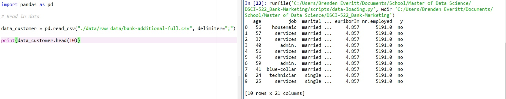

# DSCI-522_Bank-Marketing
----------------------------------
### Team members:

* Brenden Everitt (github id : everittb)

* Sabrina Kakei Tse (github id: sabrinatkk)

--------------------------------------------------
## Proposal Outline:

### 1. Dataset:

Source: https://archive.ics.uci.edu/ml/datasets/Bank+Marketing

[Moro et al., 2014] S. Moro, P. Cortez and P. Rita. A Data-Driven Approach to Predict the Success of Bank Telemarketing. Decision Support Systems, Elsevier, 62:22-31, June 2014

### 2. Question
**Type:** Predictive

_Will an existing bank customer subscribe to a new term deposit through a direct marketing campaign?_

### 3. Script

**Summary of the data:**

  

The dataset was generated by a phone marketing campaign run by a Portuguese bank . The campaign aimed to encourage the bank's existing customers to sign up for a new term deposit. The dataset contains ~45,000 examples with both quantitative and qualitative data on 20 features for each customer.  The dataset also includes the final result of the campaign that indicates the successful sign-ups.  

**Language:** Python
  - **Dependencies:**
    1. Pandas

### 4. Plan

We are going to build a Decision Tree Classifier to identify which characteristics of the clientele will lead to subscription to the new bank product.

### 5. Presentation:

- [x] Decision Tree Model to predict the characteristic of high potential subscribers

- [ ] Table to summarize the features selected by the classifier

- [ ] Conclusion to interpret the final result.
