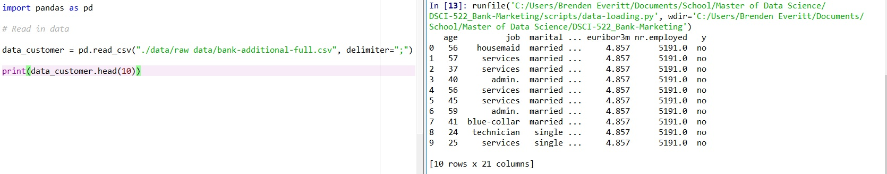

# Bank Marketing
----------------------------------
### Team members:

* Brenden Everitt (github id: everittb)

* Sabrina Kakei Tse (github id: sabrinatkk)

--------------------------------------------------
## Proposal Outline:

### 1. Dataset:

Source: https://archive.ics.uci.edu/ml/datasets/Bank+Marketing

[Moro et al., 2014] S. Moro, P. Cortez and P. Rita. A Data-Driven Approach to Predict the Success of Bank Telemarketing. Decision Support Systems, Elsevier, 62:22-31, June 2014

#### Inputs = 15 attributes of existing bank customers and datatype  
| Data Type   | Variables   |
|:-----------:|:-----------:|
| numeric     | age, balance, day, campaign, pdays, previous |
| categorical | job, marital, education, default, housing, loan, contact, month, poutcome|

source:https://archive.ics.uci.edu/ml/datasets/Bank+Marketing

### 2. Question
**Type:** Predictive

_Will an existing bank customer sign up to a new term deposit through a direct marketing campaign?_

### 3. Script

**Summary of the data:**

  

The dataset was generated by a phone marketing campaign run by a Portuguese bank. The campaign aimed to encourage the bank's existing customers to sign up for a new term deposit. The dataset contains ~45,000 examples with both quantitative and qualitative data on 20 features for each customer. The dataset also includes the final result of the campaign that indicates the successful sign-ups.  

**Dependencies:**

| Language   | Packages  |
|:-----------:|:-----------:|
| Python     | panada, argparse, numpy, matplotlib, graphviz, sklearn, seaborn |
| R          | knitr, tidyverse |

### 4. Plan

We are going to build a Decision Tree Classifier to identify which characteristics of the clientele will lead to subscription to the new bank product.

1. **Importing and cleaning data**- For variables, we will only consider 15 customer attributes. We excluded `duration` because when predicting whether or not a customer will sign up if they are contacted, it is impossible to know the duration of the call beforehand . In addition, we will also exclude the social and economic attributes: `emp.var.rate, cons.price.idx, cons.conf.idx, euribor3m, and nr.employed` because they are macro-economic factors that are not directly related to the customers that we want to study.

2. **Data Visualization** - For categorical variables, seaborn catplot will be used to plot the variable of interest against the target variable, which is `sign-up `. For continuous variables, seaborn boxplot will be used instead.

3. **Hyperparameter for Decision Tree** - we will use k-fold cross-validation to pick the maximum depth of the tree.

### 5. Presentation:

- [ ] Decision Tree Model to predict whether or not an existing customer will sign up for a new bank product through the new marketing campaign. We will provide:

  - The full tree in pdf as a reference
  - The top three layers of the tree
  - Present the prediction result for 2-3 customers
  - Test accuracy for the final model  

- [ ] Table to summarize the features selected by the classifier

  - This table ranks all of the customer features used in the model by Gini importance

### 6. Scripts
Scripts are to be run at the main directory

**Data loading and cleaning**

```python scripts/data_loading-cleaning.py ./data/raw-data/bank-additional-full.csv ./data/cleaned/bank_full.csv ```

**Data visualization**

```python scripts/data_exploratory-visualization.py ./data/cleaned/bank_full.csv job ./results/imgs/job_signup.png```

**Decision Tree Classifier**

```python scripts/create-decision-tree.py ./data/cleaned/bank_full.csv ./results/decision-tree-output.csv```

**Report in PDF format**

```Rscript -e "rmarkdown::render('./documents/Bank-Marketing-Findings.Rmd')"```
