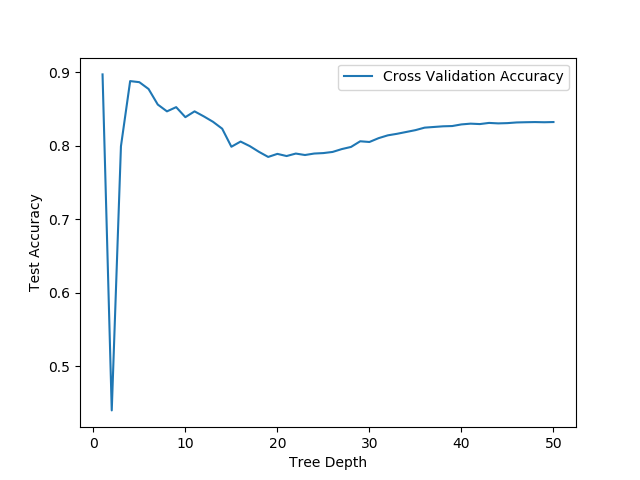

```{r setup, include=FALSE}
knitr::opts_chunk$set(echo = TRUE)
library(knitr)
```

## Background

- Goal - 
In this project, we aim to develop a predictive model that tells us whether or not the existing customer will sign up for a new term deposit through a telemarking campaign. With this goal in mind, we have decided to anchor the project development based on the following question:

> ***Will an existing bank customer subscribe to a new term deposit through a direct marketing campaign?***

- Data - 
The dataset was generated by a telemarketing campaign run by a Portuguese bank. The campaign aimed to encourage the bank's existing customers to sign up for a new term deposit. The dataset contains approximately 45,000 observations with both quantitative and qualitative data on 20 attributes. 15 of the attributes are demographic and bank-related behavioural information, while the remaining attributes are macroeconomic indexes recorded at the time of data collection. Finally, the dataset includes the final result of the campaign that indicates the successful sign-ups.

- Scope-
The scope of the project is to focus on studying the personal and direct attributes of the existing customers. The macroeconomic attributes are the external factors that are not considered at this point of our study. 

## Analysis - Decision Tree Tree

\begin{center}
\includegraphics[width=5in]{../results/imgs/Decision-Tree-depth3.pdf}
\end{center}

The above image shows a depth-3 tree generated on this dataset for illusitive purpose only. The full tree has a maximum depth of 6, which can be founded at [here](https://github.com/sabrinatkk/DSCI-522_Bank-Marketing/blob/master/results/imgs/Decision-Tree-full.pdf). The training sample size is 80% of the total size. The dependent variable is the `sign-up` variable, which carries two values indicated by `class=Yes`,`class=No` in each node. The left size of the tree contains a smaller group compared to the left side of the tree.

{width=250px}

While running Cross Validation on the Decision Tree Classifier, the result suggests that the maximum depth of 1 gives the highest model score. In order to expand the tree, we decided to pick the next best score which is the depth of 6 for the full tree. 

## Results


## Drawbacks and challenges

- Exploratory data analysis presentation -
There are 15 qualitative and quantitative variables in the dataset, and each qualitative variable has its subcategories; hence, it is challenging to bring all of the relevant variables together into one graph which could be helpful to explore the interdependence between the variables visually.

- Decision Tree Classifier -
*pdays - this variable contains numeric values that indicate the number of days, but it also includes '999', not as a numeric but a categorical value, to indicate that the customer was not previously contacted. This variable has the largest difference between the 'yes' and 'no' group within the target variable, so the tree chose this variable to begin the split. We believe that this may potentially distort the effectiveness of the tree.


## Future work
Given the limited time we had for this project, we only explored the personal attributes at this point. In the future, we hope to expand our study to include the macroeconomic variables to understand the external environments that may indirectly affect the sign-up rate. For example, the macroeconomic indexes can indicate the right timing for the next telemarking campaign. Such information will be useful for the telemarking team.

