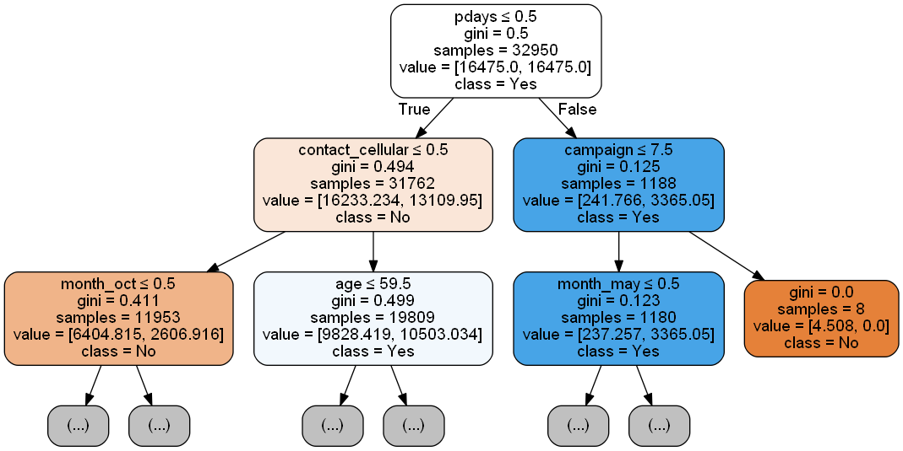

Who to Contact?
================
Brenden Everitt, Sabrina Kakei Tse
November 23, 2018

Introduction
============

#### The Problem

A Portuguese bank has a new term deposit that they want to get their existing customer signed up for. However, not every customer is going to want to sign up for this term deposit. The purpose of this analysis is to develop a model that given a particular customers information, predicts whether or not they will sign up for the new term deposit. In particular, the question that guides the analysis is:

-   **Will an existing bank customer sign up for a new term deposit through a direct marketing campaign?**

#### Data

The dataset is related to direct marketing campaigns run by the Portuguese bank and contatins information on various features of interest for approximately 45,000 customers. The features of interest can be broken down as follows:

##### Bank client data:

-   age (numeric)
-   job : type of job (categorical)
-   marital : marital status (categorical)
-   education (categorical)
-   default: has credit in default? (categorical)
-   housing: has housing loan? (categorical)
-   loan: has personal loan? (categorical)

##### Previous contact of the current campaign:

-   contact: contact communication type (categorical)
-   month: last contact month of year (categorical)
-   day\_of\_week: last contact day of the week (categorical)
-   ~~duration: last contact duration, in seconds (numeric)~~

##### Other attributes:

-   campaign: number of contacts performed during this campaign and for this client (numeric)
-   pdays: ~~number of days that passed by after the client was last contacted from a previous campaign (numeric)~~
    -   Changed to a categorical variable to just represent whether or not a client had been contacted before
-   previous: number of contacts performed before this campaign and for this client (numeric)
-   poutcome: outcome of the previous marketing campaign (categorical)

##### Social and economic context attributes

-   ~~emp.var.rate: employment variation rate - quarterly indicator (numeric)~~
-   ~~cons.price.idx: consumer price index - monthly indicator (numeric)~~
-   ~~cons.conf.idx: consumer confidence index - monthly indicator (numeric)~~
-   ~~euribor3m: euribor 3 month rate - daily indicator (numeric)~~
-   ~~nr.employed: number of employees - quarterly indicator (numeric)~~

We dropped all the variables related to social and economic attributes from our analysis because they do not provide customer specific information. Instead, they provide information on general macroeconomic factors which we felt would not help in predicting whether or not a customer would sign up for a new term deposit. Additionally, we also dropped 'duration' because our goal was to predict whether or not a customer will sign up for a term deposit through a direct marketing campaign, therefore it would be impossible to know the duration of the call beforehand.

Analysis
========

#### Exploratory Data Analysis

This section we will focus on exploring the available demographic information of the bank customers.

Exploratory questions:

-   Is there a difference in the median age of the people who signed up and who did not sign up from the training data set?

| statistics |    age\_yes|       age\_no|
|:-----------|-----------:|-------------:|
| count      |  4640.00000|  36548.000000|
| mean       |    40.91315|     39.911185|
| std        |    13.83748|      9.898132|
| min        |    17.00000|     17.000000|
| 25%        |    31.00000|     32.000000|
| 50%        |    37.00000|     38.000000|
| 75%        |    50.00000|     47.000000|
| max        |    98.00000|     95.000000|

The Age group statistics table shows that the average age of both groups are very similar. So from here, we need to dive in deeper into the sub-groups within the `job` attribute and the average age of each occupation group.

-   Occupations of the existing customers and their average ages

Figure 1

Figure 1 shows the average age of each occupation group of the bank customers and further breaks down the occupation group into `yes` and `no` groups. While it is not surprising to see that the oldest age group is the retired customers, it is interesting to see that those retired customers who signed up for the term deposit are about 8-10 years older than those who did not sign up for the deposit. The same case happens in the housemaid and unknown groups but with lesser variances. One rational explanation can be that the older the customers are , the more savings they have in their acconut and the more likely to invest through term deposit.

#### Decision Tree

The model we chose to predict whether or not a customer would sign up for the new term deposit through a direct marketing campaign was a decision tree. Before developing the decision tree we split our data into a training set (80%) and test set (20%); we then used the training dataset and 5-fold cross-validation to determine the maximum depth that the tree should be. The results from the cross-validation are shown in Figure 1 below.

Figure 2

After looking at the results from the cross-validation we decided that having a depth 4 decision tree would be the best to achieve the most accurate test predictions. Now with the maximum depth of the tree chosen the final decision tree was created using all the training data.

Results
=======

Figure 2 belows shows the first two layers of the final decision tree. The full tree can be found [here](https://github.com/sabrinatkk/DSCI-522_Bank-Marketing/blob/master/results/imgs/Decision-Tree-full.pdf).

Figure 3

Starting at the root node we see the first split is on 'pdays'. This indicates that if a customer has not been contacted before (ie. pdays = 0) they would go to the left leaf, if a customer had been contacted before they would go to the right. The splitting then continues independently on each of the two subgroups with the goal of having finding a combination of splits that result in leaf nodes being of class "Yes", which indicate that a customer would sign up for the new term deposit.

#### Feature Selection

The features the model selected as the most important, determined by the Gini Importance, are seen in Table 1 below. An interesting observation about these features is that all of them, besides age, are related to the timing of the call from the marketing campaign.

| Feature           |  Feature-Importance|
|:------------------|-------------------:|
| pdays             |           0.5212420|
| contact\_cellular |           0.2214926|
| age               |           0.0844626|
| month\_jun        |           0.0827138|
| month\_oct        |           0.0562838|

#### Model Accuracy

Testing the final decision tree on unseen test data resulted in the accuracy seen in Table 2 below:

|  Test Accuracy|
|--------------:|
|      0.8848021|

Drawbacks and challenges
========================

-   Exploratory data analysis presentation - There are 15 qualitative and quantitative variables in the dataset, and each qualitative variable has its subcategories. Thus, it is challenging to bring all of the relevant variables together into one graph which could be helpful to explore the interdependence between the variables visually.

Future work
===========

Given the limited time we had for this project,we only explored the personal attributes at this point. In the future, we hope to expand our study to include the macroeconomic variables to understand the external environments that may indirectly affect the sign-up rate. For example, the macroeconomic indexes can indicate the right timing for the next telemarking campaign. Such information will be useful for the telemarking team.

Reference
=========

1.  Dataset courtesy of UCI Machine Learning Repository

<https://archive.ics.uci.edu/ml/datasets/Bank+Marketing>

\[Moro et al., 2014\] S. Moro, P. Cortez and P. Rita. A Data-Driven Approach to Predict the Success of Bank Telemarketing. Decision Support Systems, Elsevier, 62:22-31, June 2014

1.  Project Template

<http://projecttemplate.net/getting_started.html>
